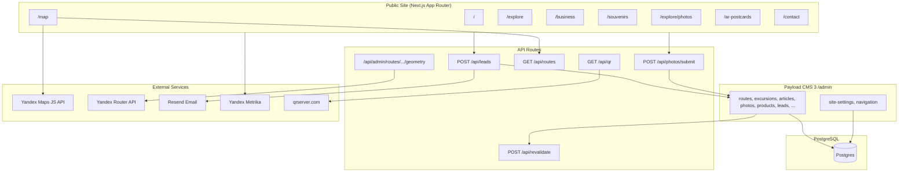

# IRKPORTAL — Total Project Reality Audit

**Дата аудита:** 2026-09-01  
**Аудитор:** объединённая экспертная группа (read-only discovery)  
**Репозиторий:** `I:\Сайты\PoleznoProIrkutsk`  
**Production URL:** https://irkportal.ru

---

## A. Final status

### **DECISION READY WITH EXPLICIT UNKNOWNS**

**Почему:** Достаточно доказательств из кода, production smoke (GET) и локальных проверок для стратегического решения. Критические продуктовые разрывы подтверждены на production. Ряд операционных и коммерческих параметров не проверяем без доступа к админке, БД и бизнес-метрикам.

| Параметр | Значение |
|----------|----------|
| **HEAD SHA** | `73ca3f7b6c72a9f0f3d1a07e0a44947ec8200a20` |
| **Ветка** | `master` (синхронизирована с `origin/master`) |
| **Dirty worktree** | Только untracked: `####/`, PDF, `public/images/Alena.jpg` — исходный код не изменён |
| **Проверенный scope** | ~297 файлов проекта; 26 page routes; 9 API routes; 15 Payload collections; production GET на 12+ URL |
| **Production evidence** | Главная, explore, business, map, souvenirs, photos, AR, contact, about, robots.txt — OK; sitemap.xml — **CURRENT 200** (исторический 500 = HISTORICAL INCIDENT / REGRESSION COVERED / OBSERVABILITY GAP, не актуальный P0) |
| **SHA production ↔ repo** | **UNKNOWN** — нет публичного build-id / commit endpoint |
| **Ограничения** | Git history через `-c safe.directory`; локальный `npm run build` падает без PostgreSQL; admin/leads/Resend не проверялись (mutating/auth); unit economics — на допущениях |

---

## B. Executive verdict

**Что реально построено:** Production-ready техническая платформа — Next.js 16 + Payload CMS 3 + PostgreSQL на VPS. Единая система заявок (LeadForm → `/api/leads` → коллекция `leads`), B2B-лендинг, редакционный раздел «Исследовать» с ~6+ опубликованными статьями, каркас карты/маршрутизации (Yandex Maps + Yandex Router API + admin geometry editor), сувениры/AR/фотоархив как CMS-модули, SEO-инфраструктура (metadata, JSON-LD, robots), Яндекс.Метрика.

**Состояние проекта:** **Платформа собрана, коммерческое ядро не наполнено.** На production карта маршрутов пуста («Ничего не найдено»), фотоархив пуст, сувениры и AR показывают seed-контент с меткой «Демо-». Статьи работают. Формы заявок доступны на всех ключевых страницах.

**Можно ли показывать и продавать:** **Частично.** B2B и «написать Алёне» — да, как lead-gen витрина. Премиальные экскурсии и маршруты — **нет**, пока нет опубликованных `routes`/`excursions` с ценами, доказательств и связанных страниц. Показывать как «полноценный навигатор» — **рано**: пустая карта подрывает обещание hero.

**Главный системный ограничитель:** Разрыв между **объёмом платформы** (7+ продуктовых модулей) и **отсутствием опубликованного коммерческого контента** в ядре (маршруты, экскурсии, реальные фото, реальные сувениры).

**Что прекратить делать:** Расширять платформу (контент-машина, Иркипедия, WebAR, Stripe, новые коллекции). Дорабатывать вторичные модули до заполнения ядра.

**На чём сосредоточиться:** Один коммерческий контур — **премиальные экскурсии + B2B программы** — на базе существующих заявок, статей (доверие/SEO) и 2–3 опубликованных маршрутов.

**Рекомендуемая стратегия:** **Revenue-first / premium excursions** (см. раздел L).

**Следующее действие:** Запустить фазу **«Commercial Core Launch»** — опубликовать минимальный набор маршрутов и экскурсий, убрать demo-метки с production, починить sitemap, включить email-уведомления о заявках (раздел O).

---

## C. Baseline и источники истины

| Область | Факт | Confidence |
|---------|------|------------|
| **Repo root** | `I:\Сайты\PoleznoProIrkutsk` | HIGH |
| **Git HEAD** | `73ca3f7` — «Безопасные admin-скрипты: отключить schema push на production» | HIGH |
| **Remote** | `https://github.com/vizuallarin-ai/polezno-pro-irkutsk.git` | HIGH |
| **Runtime** | Node 20+, Next.js 16.2.6, React 19, Payload 3.85, PostgreSQL | HIGH (`package.json`) |
| **Package manager** | npm (`package-lock.json`) | HIGH |
| **Production host** | Beget VPS, PM2, Nginx (`docs/DEPLOY-BEGET.md`) | HIGH (docs) |
| **Production URL** | https://irkportal.ru | PRODUCTION VERIFIED |
| **БД** | PostgreSQL on VPS, `DATABASE_URL` required | HIGH (code + deploy docs) |
| **Demo fallback** | `allowDemoFallback()` = false when `DATABASE_URL` set and `ALLOW_DEMO_FALLBACK` ≠ true (`lib/demo-fallback.ts:5-8`) | HIGH |
| **Последняя документированная фаза** | Phase 14, 2026-06-19, status «стабилизация» (`docs/release-phase-14.md`) | HIGH |
| **Drift docs ↔ code** | README упоминает Stripe/checkout/shop — удалены (`docs/release-phase-14.md:23`) | HIGH |
| **Lint** | 4 errors, 20 warnings (`npm run lint`) | LOCAL VERIFIED |
| **Typecheck** | `npx tsc --noEmit` — pass | LOCAL VERIFIED |
| **Build** | Fail без PostgreSQL at SSG (`generateStaticParams`, CMS pages) | LOCAL VERIFIED |
| **Tests** | Отсутствуют (0 test files) | HIGH |

### Источникам нельзя доверять без проверки

| Источник | Почему |
|----------|--------|
| `docs/site-capabilities.md` («всё работает», июнь 2026) | Карта и фото на production пусты; sitemap 500 |
| `docs/release-phase-14.md` «CLOSED / готов к наполнению» | Наполнение ядра не произошло 2+ месяца |
| README «Stripe Checkout» | Код удалён, поля legacy |
| Наличие CMS-коллекции | ≠ end-to-end пользовательский сценарий |
| Успешный compile | ≠ production E2E |
| Seed scripts как proof of prod content | Seed создаёт «Демо-» записи; routes на prod не опубликованы |

### Cursor / rules drift

| Наблюдение | Evidence | Риск |
|------------|----------|------|
| `.cursor/rules/auto-commit-push.mdc` требует auto commit+push | Противоречит user rule «commit only when asked» | Путаница для агентов |
| `AGENTS.md` → Next.js breaking changes | Корректно для Next 16 | LOW |
| Phase docs только до 14 | Нет phase 15+ в repo | Docs lag |

---

## D. Product reality map

### Формула продукта (факт)

**Иркпортал — авторская lead-gen платформа про Иркутск с CMS, где работают статьи и формы заявок, но ключевые обещания (карта маршрутов, фотоархив, премиальные экскурсии) на production не подкреплены опубликованным контентом.**

### Фактическое позиционирование (production)

- Hero: «Иркутск без штампов» — маршруты, экскурсии, места — от Алёны Ямщиковой (`https://irkportal.ru/` — PRODUCTION VERIFIED)
- Авторский блок, scenario picker (4 сценария), B2B preview, demo-сувениры на главной
- Карта: «Маршруты и экскурсии» → **пусто** (`https://irkportal.ru/map`)
- Explore: 6+ материалов, категории, CTA на экскурсию (`https://irkportal.ru/explore`)
- Business: полноценный B2B (`https://irkportal.ru/business`)

### Внутренние документы считают продуктом

«Авторская платформа / экосистема»: карта, фотоархив, B2B, сувениры, AR, единые заявки, SEO, контент без разработчика (`docs/site-capabilities.md`).

### Противоречия INTENT vs REALITY

| INTENT (docs/UI) | REALITY (production) |
|------------------|----------------------|
| Интерактивная карта с маршрутами | Пустой каталог |
| Фотоархив как медиа-актив | 0 фото |
| Премиальные экскурсии | 0 excursions на карте |
| Сувениры / AR | Seed «Демо-» контент |
| Sitemap для индексации | HTTP 500 |
| Email при заявках | Resend optional — **UNKNOWN** if configured |
| Контент-машина / Иркипедия | **ABSENT** in code |

### Аудитории и JTBD

| Аудитория | JTBD | Текущая ценность | Разрыв |
|-----------|------|------------------|--------|
| **Гость города (premium)** | Увидеть город без штампов, забронировать экскурсию | Статьи + форма | Нет каталога экскурсий/маршрутов |
| **B2B (отель/DMC/корп)** | Программа под ключ | Сильный `/business` + форма | Нет кейсов/отзывов на главной |
| **Иркутянин** | Новые места, шаринг | Статьи | Нет маршрутов/фото |
| **UGC фото** | Загрузить фото | Форма submit | Архив пуст — нет social proof |
| **Редактор (Алёна)** | Публиковать без dev | CMS admin | Контент не доведён до publish |

### Основная конверсия (фактическая инфраструктура)

**Lead capture** — единственная end-to-end автоматизированная конверсия: форма → `POST /api/leads` → Payload `leads` (+ optional Resend).

### Revenue paths (факт vs потенциал)

| Модель | CODE | PRODUCTION | Статус |
|--------|------|------------|--------|
| Экскурсии с гидом (lead) | `Excursions`, LeadForm | Нет published | PARTIAL |
| B2B программы (lead) | `/business`, B2B schema | Работает UI | LOCAL+PROD UI |
| Сувениры (lead) | `/souvenirs`, product forms | Demo catalog | PARTIAL |
| AR открытки (lead) | `/ar-postcards` | Demo | PARTIAL |
| Онлайн-оплата | Stripe removed | N/A | ABSENT |
| Подписка Boosty | Link in nav | External | ORPHAN CTA |
| Контент-машина / ads | — | — | ABSENT |

### Роль Алёны

**INTENT + PRODUCTION VERIFIED (copy):** автор навигатора, гид, медийное лицо — hero, about, article bylines. Оператор CMS (admin-only). Продукт = личный бренд + lead funnel, не self-serve marketplace.

### Ядро vs конкурирующие продукты

**Нет одного ядра в UX.** Конкурируют: (1) навигатор/карта, (2) медиа/explore, (3) B2B, (4) сувениры, (5) фото UGC, (6) AR. **Фактически работает только (2)+(3) как контент+лиды.** Остальное — shell.

---

## E. Architecture map

**Границы:** Вся бизнес-логика чтения — `lib/*` + Payload adapters. Demo data — `lib/data/*` (fallback). Нет отдельного backend, queue, search engine, AI pipeline. ISR/revalidate через hooks + secret header.

---

## F. Feature truth table

| Subsystem | Intended job | Evidence | Reality status | E2E status | Production proof | Dependency | Owner | Risk | Decision | Closure criterion |
|-----------|--------------|----------|----------------|------------|------------------|------------|-------|------|----------|-------------------|
| **Home / brand** | Первое впечатление, scenario routing | `app/(site)/page.tsx` | IMPLEMENTED | PARTIAL | 200 OK, hero live | CMS site-settings | Алёна | Demo souvenirs on home | FINISH | Real hero photo, no demo products in preview |
| **Map / routes** | Каталог маршрутов + карта | `app/(site)/map/*`, `lib/routes.ts`, `lib/experiences.ts` | IMPLEMENTED | **BROKEN on prod** | Empty catalog | Yandex Maps key, published routes | Алёна | P0 — empty core | FINISH | ≥2 published routes with geometry on /map |
| **Excursions** | Страницы guided tours | `Excursions.ts`, `/excursions/[slug]` | IMPLEMENTED | UNVERIFIED | 0 on map | CMS publish | Алёна | No sellable offers | FINISH | ≥1 excursion published, price, CTA tested |
| **Route geometry** | Pedestrian routing | `lib/route-geometry/*`, admin API | IMPLEMENTED | LOCAL UNVERIFIED | N/A | YANDEX_ROUTER_API_KEY | Admin | API quota/cost | KEEP | 1 route built via admin, displayed on map |
| **Explore / articles** | SEO + trust content | `Articles.ts`, `lib/explore.ts` | IMPLEMENTED | PRODUCTION VERIFIED | `/explore/irkutsk-winter` 200 | CMS | Алёна | OK | KEEP | 10+ evergreen articles indexed |
| **Irkipedia layer** | Knowledge graph | — | ABSENT | — | — | — | — | Premature | POSTPONE | Revisit after 50+ articles OR clear SEO win |
| **Photo archive** | UGC + moderation | `Photos.ts`, submit API | IMPLEMENTED | PARTIAL | Empty `/explore/photos` | Moderation workflow | Алёна | Empty trust | FINISH | ≥20 approved photos OR hide section |
| **Photo submit** | Crowdsource | `POST /api/photos/submit` | IMPLEMENTED | UNVERIFIED | Form exists | DB, storage | Алёна | Legal/moderation load | KEEP | 1 test submission through moderation (manual) |
| **B2B / business** | Corporate leads | `app/(site)/business/page.tsx` | IMPLEMENTED | PRODUCTION VERIFIED | Full page 200 | Static + form | Алёна | Strongest ready module | KEEP | 1 B2B lead → closed deal logged |
| **Lead system** | Unified CRM intake | `app/api/leads/route.ts`, `Leads.ts` | IMPLEMENTED | PARTIAL | Forms render | Resend optional | Алёна | Leads only in admin | FINISH | Email notify on + SLA response |
| **Souvenirs** | Merch lead catalog | `Products.ts`, `/souvenirs` | IMPLEMENTED | PARTIAL | Demo products live | CMS | Алёна | Demo labels | FINISH | Real products OR unpublish demo |
| **AR postcards** | QR → web story | `ArPostcards.ts`, `/api/qr` | IMPLEMENTED | PARTIAL | Demo cards | Media assets | Алёна | «Скоро» items | SIMPLIFY | 1 real AR asset OR hide «скоро» |
| **Events** | Calendar | `Events.ts` | IMPLEMENTED | UNVERIFIED | Hidden in nav (no events) | CMS | Алёна | OK empty hide | POSTPONE | Publish when ≥3 events |
| **Reviews / social proof** | Trust on home | `Reviews.ts`, `SocialProof` | IMPLEMENTED | UNVERIFIED | Generic bullets, no real reviews | CMS featured | Алёна | Trust gap | FINISH | 3 featured reviews published |
| **Newsletter** | Email capture | `POST /api/newsletter` | IMPLEMENTED | UNVERIFIED | Weak validation | Creates lead | — | Low priority | POSTPONE | Merge into leads or remove |
| **Stripe / checkout** | Online pay | Legacy fields | LEGACY | ABSENT | Redirects /shop | — | — | Confusion | REMOVE | Fields removed from schema + README |
| **Content machine / AI** | Auto content | grep: no matches | ABSENT | — | — | — | — | — | POSTPONE | Not before manual editorial rhythm |
| **SEO sitemap** | Indexation | `app/sitemap.ts` | IMPLEMENTED | **CURRENT 200** | Historical 500 not reproduced | — | OBSERVABILITY GAP | MONITOR | Live GET 200 + contract checks |
| **SEO robots** | Crawl rules | `app/robots.txt/route.ts` | IMPLEMENTED | PRODUCTION VERIFIED | 200 + Host | — | — | OK | KEEP | — |
| **Yandex Metrika** | Analytics | `yandex-metrika.tsx`, ID 109995467 | IMPLEMENTED | PRODUCTION VERIFIED | Script in layout | Metrika goals | Алёна | Goals unknown | FINISH | Goals: lead_submit, messenger_click |
| **Auth / RBAC** | Admin protection | `payload/access.ts` | IMPLEMENTED | UNVERIFIED | admin 200 (login page) | PAYLOAD_SECRET | Admin | Editor role useless | SIMPLIFY | Document admin-only model |
| **Revalidate API** | ISR | `app/api/revalidate/route.ts` | IMPLEMENTED | UNVERIFIED | Secret header | REVALIDATE_SECRET | Dev | OK if secret strong | KEEP | Hook fires on CMS save |
| **Rate limit / spam** | Abuse control | `lib/lead-spam.ts` | IMPLEMENTED | PARTIAL | In-memory IP map | Single instance VPS | Dev | Resets on restart | INVESTIGATE | Persistent limit or edge rule |
| **Email (Resend)** | Notifications | `lib/email.ts` | IMPLEMENTED | UNKNOWN | Silent skip if no key | RESEND_API_KEY | Admin | Missed leads | FINISH | Test email on lead create |
| **Deploy** | VPS pipeline | `docs/DEPLOY-BEGET.md`, PM2 | IMPLEMENTED | UNVERIFIED | Site live | — | Dev | Build needs DB | KEEP | Document build-with-DB requirement |

---

## G. Journey findings

### 1. Гость города → экскурсия

| Step | Status | Evidence |
|------|--------|----------|
| SEO/соцсеть → landing | WORKS | Home 200, OG metadata in layout |
| Выбор сценария | WORKS | Scenario picker |
| Карта / маршрут | **DEAD END** | `/map` empty |
| Доверие (статьи) | WORKS | `/explore/irkutsk-winter` |
| Заявка | WORKS (UI) | LeadForm on all pages |
| Подтверждение | MANUAL | No auto-reply unless Resend |
| Услуга | OFFLINE | — |
| Отзыв | HOOK exists | Email on lead close (`Leads.ts:23-39`) |

**Минимальное закрытие:** 2 маршрута + 1 экскурсия с ценой + ответ на заявку ≤24ч.  
**Метрика:** lead → paid excursion conversion (manual CRM).

### 2. Premium клиент экскурсии

| Step | Status |
|------|--------|
| Premium packaging | PARTIAL — copy premium, no product pages |
| Proof (reviews, photos) | WEAK — no featured reviews |
| Availability | ABSENT |
| Payment | ABSENT — lead only (acceptable for premium pilot) |
| Follow-up | UNKNOWN — Resend |

**Dead end:** нет страницы экскурсии с ценой «от X ₽ / до 5 чел / 1 час».

### 3. Иркутянин

Explore works; map/photos empty → **no save/share loop**.

### 4. UGC фото

Submit form (`/explore/photos/submit`, noindex) + API with consents — **CODE complete**. Archive empty → **no publication loop visible**.

### 5. Редактор/гид

CMS admin (`payload.config.ts`) — full collections. Route geometry panel in admin. **Operational gap:** content not published; seed not run or drafts.

### 6. Контент-машина

**ABSENT** — no backlog, prompts, scheduling, AI. Manual CMS only.

### 7. B2B партнёр

**Strongest journey:** `/business` → B2B form → leads. Deep links from routes **blocked** (no routes).

### Mobile / states

- Forms: mobile-first declared (`site-capabilities.md`)
- Empty states: human copy on map/photos (**good**)
- Loading: map shows «Загрузка карты…» (JS-dependent)
- Error: lead API returns 429/400 — **not browser-tested** (read-only)

---

## H. Scorecard

| Direction | Score | Evidence |
|-----------|-------|----------|
| Product clarity | **2/5** | Multiple modules; hero promises routes; map empty |
| Audience/value fit | **3/5** | Strong copy for premium/B2B; weak delivery |
| Public UX | **3/5** | Editorial design, Lenis/GSAP; empty core frustrates |
| Premium perception | **2/5** | «Демо-сувенир» on production (`/souvenirs`) |
| Content depth & trust | **3/5** | Articles OK; no reviews/routes/photos |
| SEO readiness | **2/5** | robots OK; **sitemap 500**; articles indexable |
| Content operations | **3/5** | CMS mature; no editorial calendar/automation |
| Route/map readiness | **2/5** | Tech ready (`route-geometry`); 0 published routes |
| Conversion readiness | **3/5** | Lead forms everywhere; no notify proof |
| Analytics/attribution | **3/5** | Metrika + custom events (`lib/analytics-events.ts`); goals UNKNOWN |
| Admin operability | **3/5** | Payload admin; admin-only; geometry editor |
| Code maintainability | **3/5** | TS strict, modular lib; 0 tests; lint errors |
| Security/privacy | **3/5** | Zod, honeypot, rate limit; in-memory limit; open lead create by design |
| Performance | **UNKNOWN** | No Lighthouse/CWV run in audit |
| Reliability/operations | **2/5** | sitemap 500; build requires live DB |
| Monetization readiness | **2/5** | Lead-only; no sellable excursion SKUs live |

---

## I. Risk and gap register

### P0

| ID | Issue | Evidence | Impact | Likelihood | Journey | Recommendation | DoD |
|----|-------|----------|--------|------------|---------|----------------|-----|
| P0-1 | **Sitemap HTTP 500** | Historical incident (not current). Classification: `CURRENT 200 / HISTORICAL INCIDENT / REGRESSION COVERED / OBSERVABILITY GAP` | Was SEO risk | LOW now | Organic discovery | Keep contract checks; do not rewrite sitemap without proven failure | Live GET 200 + phase15 sitemap contracts |
| P0-2 | **Zero published routes/excursions** | `/map` «Ничего не найдено» | Core promise broken; no excursion sales path | HIGH | Guest, premium | Publish ≥2 routes + ≥1 excursion via CMS | Visible on /map with detail pages |
| P0-3 | **Demo-labeled public products** | «Демо-сувенир Иркпортала» on `/` and `/souvenirs` | Destroys premium trust | HIGH | Premium | Unpublish demo OR replace with real/unbranded | No «Демо» string on public pages |

### P1

| ID | Issue | Evidence | Impact | Recommendation | DoD |
|----|-------|----------|--------|----------------|-----|
| P1-1 | Empty photo archive | `/explore/photos` empty | UGC promise weak | Seed 15+ real OR hide nav item | Photos visible OR nav hidden |
| P1-2 | Resend not verified | `lib/email.ts:7-8` skip if no key; phase-14 todo | Leads only in admin | Configure RESEND + enable in site-settings | Test lead triggers email |
| P1-3 | No automated tests | 0 test files | Regressions undetected | Add smoke tests for leads + sitemap | CI test script green |
| P1-4 | Local/prod build needs DB | build log ECONNREFUSED postgres | Deploy fragility | Document; ensure prod build on VPS with DB | `npm run build` on VPS succeeds |
| P1-5 | README/docs drift (Stripe) | README L17, L87 vs release-phase-14 | Wrong agent/owner expectations | Update docs in next phase | README matches code |

### P2

| ID | Issue | Evidence | Recommendation |
|----|-------|----------|----------------|
| P2-1 | In-memory rate limit | `lib/lead-spam.ts:7` Map | PM2 restart clears; consider Redis/nginx |
| P2-2 | Editor role dead | `access.ts` — editors can't access admin | Remove role or implement |
| P2-3 | Lint errors (4) | `route-map.tsx`, `routes-page-client.tsx` | Fix in maintenance |
| P2-4 | JSON-LD unused schemas | `organizationSchema` unused in `lib/jsonld.ts` | Add or remove |
| P2-5 | `/api/qr` external dependency | qrserver.com | Self-host QR or monitor SLA |

### P3

| ID | Issue | Recommendation |
|----|-------|----------------|
| P3-1 | Boosty/Club in nav without product | Keep as external or integrate content |
| P3-2 | Newsletter weak validation | Merge to leads |
| P3-3 | Cursor auto-commit rule conflict | Align rules with owner preference |

---

## J. Complexity and dead-weight register

| Item | Type | Decision | Rationale |
|------|------|----------|-----------|
| Stripe fields (`Products.stripePriceId`, `Routes.stripeProductId`) | LEGACY | REMOVE | No checkout code |
| `/shop` redirects + referer mapping | LEGACY | KEEP | SEO preservation |
| Demo seed scripts (phase 8/10/12) | Useful dev | SIMPLIFY | Don't publish demo to prod |
| `editor` role | ORPHANED | SIMPLIFY | Admin-only in practice |
| Content machine (not built) | PREMATURE | POSTPONE | No code |
| Irkipedia concept | PREMATURE | POSTPONE | Articles enough for 90d |
| AR WebAR full | PREMATURE | SIMPLIFY | QR→web page sufficient |
| Separate `Excursions` + `Routes` | DUPLICATED UX | MERGE (UX) | Single catalog already in `experiences.ts` |
| GSAP + Lenis + Framer | COST | KEEP | Brand feel; watch perf |
| Route geometry admin + Yandex API | OPERATIONAL COST | KEEP (hybrid) | Manual fallback exists |
| 15 Payload collections | BREADTH | SIMPLIFY ops | Pause new collections |
| `playwright` for PDF only | ORPHANED dep | KEEP | Low cost |

---

## K. Business and unit economics

### Исходные цены (из брифа аудита — INTENT, не verified in product)

| Формат | Цена | Длительность |
|--------|------|--------------|
| Пешая экскурсия | ~8 000 ₽ | 1 ч, до 5 чел |
| Авто экскурсия | ~30 000 ₽ | 2,5 ч |

**Цель:** 30 000 ₽/день при личной занятости ≤3 ч на экскурсиях.

### Допущения (ASSUMPTION)

| Parameter | Assumption |
|-----------|------------|
| Variable cost per tour | 10–20% (транспорт, материалы) |
| Sales/prep time outside tour | +1–2 ч/день (переписка, логистика) |
| Cancellation rate | 15% |
| Seasonality | −40% off-season months |
| Tax/social | Not modeled — owner decision |
| Site conversion visit→lead | 1–3% (ASSUMPTION — no analytics data) |
| Lead→paid | 20–40% manual (ASSUMPTION) |

### Сценарии достижения 30 000 ₽/день (gross, on-tour time ≤3h)

| Scenario | Mix | Gross/day | On-tour time | Notes |
|----------|-----|-----------|--------------|-------|
| **A — Auto-first** | 1× auto 30k | 30 000 ₽ | 2,5 h | Meets goal in one sale; need ~3–10 leads/day at 10–30% close |
| **B — Walking-heavy** | 4× walking 8k | 32 000 ₽ | 4 h | **Exceeds 3h cap** — need higher price or larger groups |
| **C — Hybrid** | 1× walking 8k + 1× auto 30k | 38 000 ₽ | 3,5 h | Slightly over cap; premium positioning |
| **D — Premium walking** | 2× walking 15k (ASSUMPTION upsell) | 30 000 ₽ | 2 h | Requires repositioning price on site |

### Break-even logic (platform)

Fixed costs (VPS, domain, tools): ~ASSUMPTION 3–8k ₽/mo — low. **Platform ROI is positive if ≥1–2 excursions/month** — bottleneck is **demand**, not software.

### Недостающие данные

- Actual lead volume and sources (Metrika)
- Close rate and average deal size
- Resend/admin SLA
- Seasonal occupancy
- CAC by channel

### Вывод

Premium excursions **viable** as business; site **can support** lead-gen **today** for B2B and contact, but **not** for excursion SKUs until routes/excursions published with prices and proof.

---

## L. Strategic options

| Option | Primary audience | Core conversion | Time to evidence | Revenue proximity | Complexity | Defensibility | Reversibility | Must pause |
|--------|------------------|-----------------|------------------|-------------------|------------|---------------|---------------|------------|
| **A — Revenue-first (RECOMMENDED)** | Premium guests + B2B | Lead → booked excursion | 2–4 weeks | **Highest** | Low (content ops) | Author + local expertise | High | AR scale, UGC scale, AI |
| **B — Media-first (RESERVE)** | Organic search | Read → subscribe/return | 2–6 mo | Medium | Medium content | SEO library | High | New modules |
| **C — Platform-first (NOT NOW)** | Locals/UGC | Upload → community | 6+ mo | Low | **Highest** | Weak without scale | Low | Excursion focus |

### Рекомендация

**Primary: A — Revenue-first premium excursions + B2B**  
**Reserve: B — deepen explore articles for SEO supporting A**  
**Reject now: C — Irkipedia/UGC platform**

**Факты:** Lead infra ready; B2B page production-grade; map/excursions empty; no content machine; demo content hurts premium; owner time scarce — revenue path must minimize ops.

---

## M. Recommended target state (90 days)

### Ядро

1. **2–4 published walking/auto excursions** with prices, duration, group size, booking CTA  
2. **2–3 self-guided routes** on map (manual geometry OK)  
3. **B2B page** as secondary converter (keep)  
4. **3–5 featured reviews** on home  
5. **Lead notify** email + 24h response SLA (manual)

### Supporting layers

- 10–15 explore articles (evergreen SEO)  
- 1 real souvenir SKU OR hide souvenirs until ready  
- Metrika goals on lead_submit

### Excluded (90d)

- Content machine / AI generation  
- Full Irkipedia taxonomy  
- WebAR  
- Stripe checkout  
- Maker marketplace scale  
- Complex routing automation for every route (manual polyline first)

### Target architecture

Same stack — **no rewrite**. Reduce public nav to: Map, Explore, Business, About, Contact. De-emphasize Photos/AR/Souvenirs until content exists.

---

## N. 90-day decision roadmap

### T+0–14 days: Prove & stabilize

| Action | Scope | Out of scope | Complexity | Metric | Stop if |
|--------|-------|--------------|------------|--------|---------|
| Fix sitemap 500 | Debug `app/sitemap.ts` + DB | New features | S | sitemap 200 | — |
| Publish 1 excursion + 2 routes | CMS content only | New code | M | Visible /map | — |
| Unpublish demo products/AR | CMS status draft | — | S | No «Демо» on site | — |
| Enable Resend notifications | Env + site-settings | SMS | S | Email received | — |
| Add 3 reviews to home | CMS reviews featured | — | S | Reviews visible | — |

### T+15–45 days: Market proof

| Action | Scope | Metric | Stop if |
|--------|-------|--------|---------|
| Manual sales sprint (Telegram/hotels) | 20 outreach | 3 paid excursions | 0 leads in 30d |
| 5 new articles | Editorial | Organic sessions +20% | — |
| Metrika goals | lead_submit | Events in Metrika | — |
| Photo archive: 15 photos OR hide | Content/mod nav | — | — |

### T+46–90 days: Amplify what works

| Action | Scope | Metric |
|--------|-------|--------|
| Double down on winning channel | Content + landing tweaks | CAC < 30% margin |
| B2B case study page | 1 PDF/case | 1 B2B deal |
| Optional: 1 AR/souvenir real SKU | If margin fits | 5 orders |

---

## O. Next implementation phase

### **Phase 15 — Commercial Core Launch**

**Причина:** Shortest path to revenue proof; fixes P0 product/SEO gaps without new architecture.

**Goal:** Visitor can choose a **real** excursion/route and submit a **tracked** lead; owner gets **email**; sitemap works.

**Prerequisites:** CMS admin access; production env vars; real copy/photos from owner.

**In scope:**
1. Fix sitemap 500 (code if bug; ops if env)  
2. CMS: publish 1 excursion (price, duration) + 2 routes (points, geometry manual or API)  
3. Unpublish all demo-labeled products/AR  
4. Configure Resend + `leadNotificationEnabled`  
5. Publish 3 reviews  
6. Metrika goals documentation  
7. Update README (remove Stripe)

**Out of scope:** New features, content machine, payment, UGC scale, routing automation for all routes.

**Sequence:** sitemap fix → content publish → demo unpublish → email → reviews → smoke `check:prod`

**Risks:** Owner content bottleneck; Yandex API key missing for map.

**Rollback:** Draft CMS entries; revert env.

**Definition of Done:**
- [ ] `GET /sitemap.xml` → 200  
- [ ] `/map` shows ≥3 experiences  
- [ ] `/excursions/{slug}` loads with price  
- [ ] No «Демо-» on public pages  
- [ ] Test lead → email to owner  
- [ ] `npm run lint` 0 errors (optional stretch)  
- [ ] `docs/release-phase-15.md` written by owner

---

## P. Owner decisions (max 10)

| # | Question | Why | Options | Consequences | Default |
|---|----------|-----|---------|--------------|---------|
| 1 | **Primary SKU: walking vs auto vs B2B?** | Sets site emphasis | Walking / Auto / B2B mix | Different landing copy | Hybrid: 1 auto + 2 walking |
| 2 | **Hide empty sections (photos/souvenirs/AR)?** | Empty hurts trust | Hide vs keep with «скоро» | Nav simplicity | Hide until 5+ items |
| 3 | **Publish seed routes or write fresh?** | Speed vs quality | Seed+edit vs new | Time to launch | Seed+rewrite texts |
| 4 | **Resend sender domain** | Email deliverability | Own domain vs Resend sandbox | Inbox rate | Own domain |
| 5 | **Response SLA for leads** | Conversion | 4h / 24h / 48h | Expectations | 24h business days |
| 6 | **Pricing public vs «по запросу»** | Premium signaling | Show price / hide | Filter quality | Show «от X ₽» |
| 7 | **Boosty/Club priority** | Focus | Active / link only / remove | Audience split | Link only |
| 8 | **Photo UGC now?** | Ops load | Open submit / pause | Moderation time | Pause marketing until 20 archived |
| 9 | **Target daily revenue vs hours** | Validates economics | 30k/3h strict vs flexible | Schedule | Strict — drives auto/hybrid |
| 10 | **Brand name: Иркпортал vs Полезно про Иркутск** | SEO/branding | Unified vs dual | Search confusion | Иркпортал public, legacy in footer |

---

## Q. Evidence appendix

### Commands & results

| Command | Result |
|---------|--------|
| `git -c safe.directory=... rev-parse HEAD` | `73ca3f7b6c72a9f0f3d1a07e0a44947ec8200a20` |
| `git -c safe.directory=... status -sb` | `## master...origin/master` + untracked only |
| `npm run lint` | **FAIL** — 4 errors, 20 warnings |
| `npx tsc --noEmit` | **PASS** |
| `npm run build` | **FAIL** — Postgres ECONNREFUSED at SSG (local `.env.local` has DATABASE_URL but no server) |

### Production smoke (GET, 2026-09-01)

| URL | Status | Notes |
|-----|--------|-------|
| https://irkportal.ru/ | 200 | Hero, demo souvenirs in preview |
| https://irkportal.ru/map | 200 | **Empty catalog** |
| https://irkportal.ru/explore | 200 | Featured materials |
| https://irkportal.ru/explore/irkutsk-winter | 200 | Full article |
| https://irkportal.ru/explore/photos | 200 | **Empty** |
| https://irkportal.ru/business | 200 | Full B2B |
| https://irkportal.ru/souvenirs | 200 | Demo products |
| https://irkportal.ru/ar-postcards | 200 | Demo AR |
| https://irkportal.ru/contact | 200 | Form |
| https://irkportal.ru/about | 200 | Manifesto |
| https://irkportal.ru/robots.txt | 200 | Host + sitemap link |
| https://irkportal.ru/sitemap.xml | **200** | CURRENT OK — historical 500 = OBSERVABILITY GAP |

### Route inventory (page.tsx)

`/`, `/map`, `/map/[slug]`, `/excursions/[slug]`, `/explore`, `/explore/[slug]`, `/explore/photos`, `/explore/photos/[slug]`, `/explore/photos/submit`, `/events`, `/events/[slug]`, `/souvenirs`, `/souvenirs/[slug]`, `/souvenirs/makers/[slug]`, `/souvenirs/submit-maker`, `/souvenirs/success`, `/ar-postcards`, `/ar-postcards/[slug]`, `/business`, `/program` (redirect), `/about`, `/about/guides`, `/contact`, `/privacy`, `/admin/*`

### API inventory

`POST /api/leads`, `POST /api/newsletter`, `POST /api/photos/submit`, `GET /api/routes`, `GET|POST /api/admin/routes/[routeId]/geometry`, `GET /api/qr`, `POST /api/revalidate`, `GET /robots.txt`, Payload REST `/api/*`

### Payload collections

routes, leads, articles, photos, events, excursions, makers, products, ar-postcards, media, users, places, guides, reviews, partners + globals site-settings, navigation

### Key files reviewed

`package.json`, `payload.config.ts`, `next.config.ts`, `lib/demo-fallback.ts`, `lib/routes.ts`, `lib/explore.ts`, `lib/experiences.ts`, `lib/email.ts`, `lib/lead-spam.ts`, `payload/access.ts`, `app/api/leads/route.ts`, `app/sitemap.ts`, `docs/release-phase-14.md`, `docs/site-capabilities.md`, `scripts/seed-*.mjs`, `scripts/check-prod-health.mjs`

### UNKNOWNs

- Production commit SHA vs `73ca3f7`
- RESEND_API_KEY configured on VPS
- Count of leads in CMS
- YANDEX_MAPS / ROUTER keys validity on prod (map shows loading state in fetch — JS required)
- Core Web Vitals
- Search Console indexed pages count
- Whether seed routes exist as drafts in CMS

### Audit constraints honored

- No code/config/DB/production mutations  
- No commits/pushes  
- No authenticated admin access  
- No form submissions to production  
- Secrets not exposed  

---

*End of audit report.*
